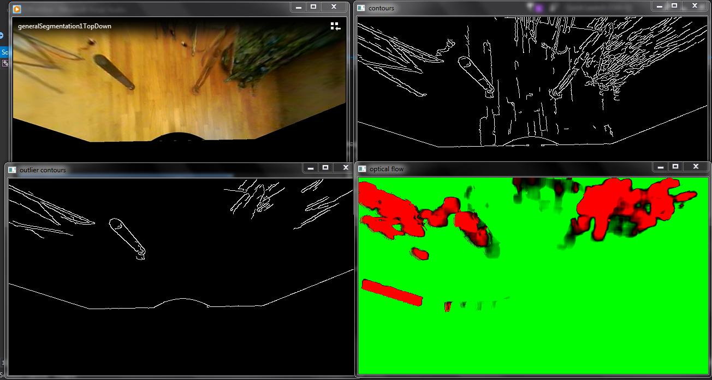

# opticalFlow
Given a top-down video from a moving vehicle, this program uses optical flow techniques to segment an image frame from the video into a ground portion and a moving/elevated portion. The user has 2 options - (i) using dense optical flow and (ii) sparse optical flow.

### (i) Dense Optical Flow

Flow vectors are calculated for the movement of each pixel between 2 successive frames in a video. Objects/Structures that protrude from the ground have larger displacements, and thus larger flow vectors, and are colored accordingly. Contours are generated based on the original image and this is compared with the flow vectors to outline the shapes of objects that rise from the ground.



(Clockwise, from top left: initial image, contour detection, dense optical flow calculation, final shortlisted contours)

### (ii) Sparse Optical Flow


To speed up computation, optical flow is only calculated for a sparse grid of points using the Lucas Kanade method. The results are drawn onto the video frame, with pixels that have large displacement highlighted (i.e. pixels representing objects that lie above the ground plane).

Usage (after compiling):

```./[Program Name] [VideoFileName] ```
